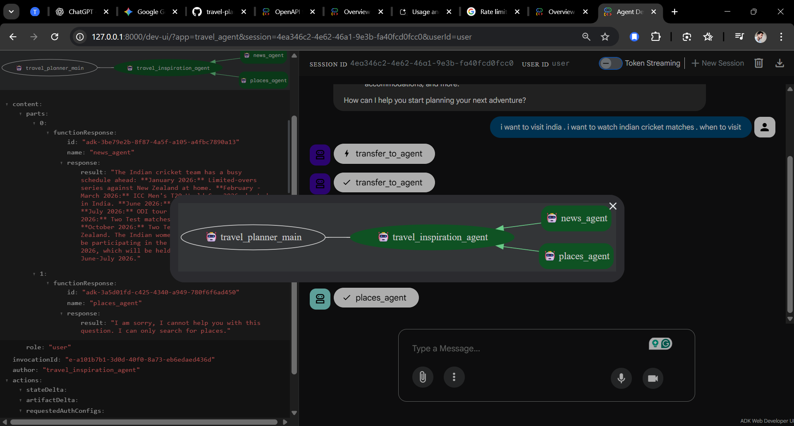
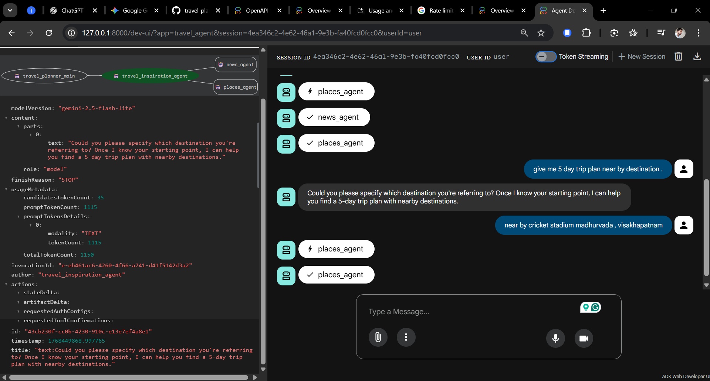

# 🌬️ hawa.ai

## Multi-Agent AI Travel Planner with Google ADK & Open Geodata

**hawa.ai** is an experimental multi-agent AI travel concierge that researches destinations, surfaces relevant events and travel news, and discovers nearby places — all orchestrated using the Google Agent Development Kit (ADK) and powered by open geodata.

The system composes multiple specialized agents into a single planner that can inspire trips, contextualize locations, and generate grounded travel suggestions without relying on paid location APIs.

### ✨ What hawa.ai Can Do

- 🌍 **Suggest destinations & trip ideas** based on user intent.
- 📰 **Surface travel news & events** using web-grounded search.
- 📍 **Find nearby places** (hotels, cafes, landmarks) using OpenStreetMap.
- 🧭 **Geocode & contextualize locations** with free, open tools.
- 🤖 **Orchestrate multiple agents** via Google ADK.
- ⚡ **Fast & reproducible Python workflows** using `uv`.

---



### 🧩 Agents & Tools

#### Agents

| Agent | Description |
| :--- | :--- |
| **root_agent** | Entry-point planner that orchestrates other agents. |
| **travel_inspiration_agent** | Guides destination discovery & inspiration. |
| **news_agent** | Fetches relevant travel news & events. |
| **places_agent** | Finds nearby places using OpenStreetMap. |

#### Tools

| Tool | Description |
| :--- | :--- |
| **Google Search_grounding** | Web-grounded search wrapper for concise results. |
| **location_search_tool** | Free nearby place search using Overpass + Nominatim. |

---

### 🛠️ Tech Stack

- **Python 3.11+**
- **Google Agent Development Kit (ADK)**
- **uv** – Ultra-fast Python package & environment manager
- **OpenStreetMap** (Overpass + Nominatim)
- **geopy**
- **python-dotenv**

---




### 📁 Project Structure

```text
hawa-ai/
├── main.py
├── pyproject.toml
├── README.md
└── travel_planner/
    ├── agent.py
    ├── supporting_agents.py
    ├── tools.py
    └── __pycache__/   # ignored
```

---

### ⚙️ Prerequisites

- Python 3.11+
- macOS / Linux (Windows users: WSL recommended)
- A Google API key (for ADK models/tools)

---

### 🚀 Setup (Using uv)

#### 1️⃣ Install uv

**macOS:**
```bash
brew install uv
```

**Universal:**
```bash
curl -LsSf https://astral.sh/uv/install.sh | sh
```

#### 2️⃣ Create & activate virtual environment

```bash
uv venv .venv
source .venv/bin/activate
# Windows: .venv\Scripts\activate
```

#### 3️⃣ Install dependencies

```bash
uv sync
```

To add dependencies later:
```bash
uv add package_name
```

---

### 🔐 Environment Variables

Create a `.env` file in the project root:

```ini
GOOGLE_API_KEY=your_api_key_here
```

The project uses `python-dotenv` to load environment variables automatically.

---

### ▶️ Running the Project

#### Simple sanity check
```bash
uv run python main.py
```

#### Using the root agent directly

```python
from travel_planner.agent import root_agent

query = "Family-friendly summer trip in Europe near beaches"
response = root_agent.run(query)
print(response)
```

#### Using the inspiration agent explicitly

```python
from travel_planner.supporting_agents import travel_inspiration_agent

travel_inspiration_agent.run(
    "Find boutique hotels near the Eiffel Tower"
)
```

---

### 🧪 Example Use Cases

- “Weekend trip ideas near Bangalore”
- “Cafes and landmarks near Times Square”
- “Family-friendly summer destinations in Europe”
- “Travel events happening in Japan this month”

---

### 🧱 Extending hawa.ai

Ideas for future improvements:

- 💰 **Budget & cost estimation agent**
- 🗺️ **Itinerary export** (JSON / Markdown / PDF)
- ⚡ **Caching layer** for geocoding & Overpass queries
- ⏱️ **Rate-limiting & retry/backoff** for Overpass
- 🌐 **Frontend UI** or chat interface

---

### ⚠️ Error Handling & Edge Cases

| Scenario | Behavior |
| :--- | :--- |
| **Missing geocode results** | Returns helpful message. |
| **Overpass throttling** | Graceful failure (retry recommended). |
| **Empty user queries** | Input validation advised. |

---

### 🧑‍💻 Development Cheatsheet

```bash
# Add dependency
uv add rich

# Sync dependencies
uv sync

# Run a module
uv run python -m travel_planner.agent

# Export requirements
uv export --format requirements-txt > requirements.txt
```

---

### 📌 Why This Project Matters

This project demonstrates:
- Agentic AI design
- Multi-agent orchestration
- Grounded search
- Open data usage
- Production-grade Python tooling

It is designed as both a learning project and a portfolio-ready system.

---

### 📄 License

MIT License — free to use, modify, and distribute.

### 🙌 Acknowledgements

- Google Agent Development Kit (ADK)
- OpenStreetMap contributors
- Overpass API & Nominatim
- Astral’s uv

> *hawa.ai is intentionally lightweight, modular, and extensible — designed to explore how multi-agent systems can power real-world applications like travel planning. If you find this useful, ⭐ the repo and feel free to contribute!*